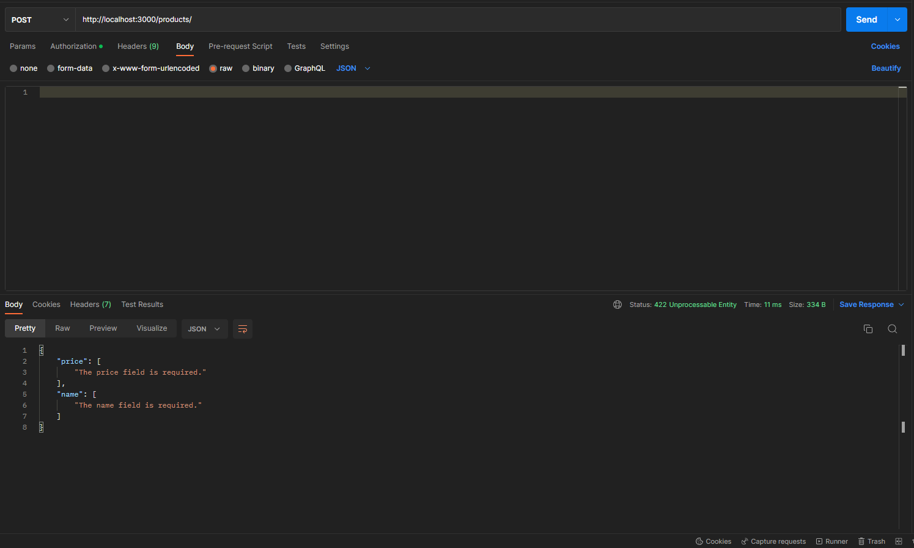
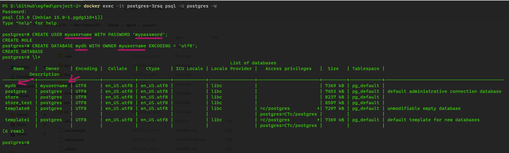
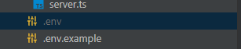
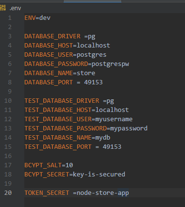
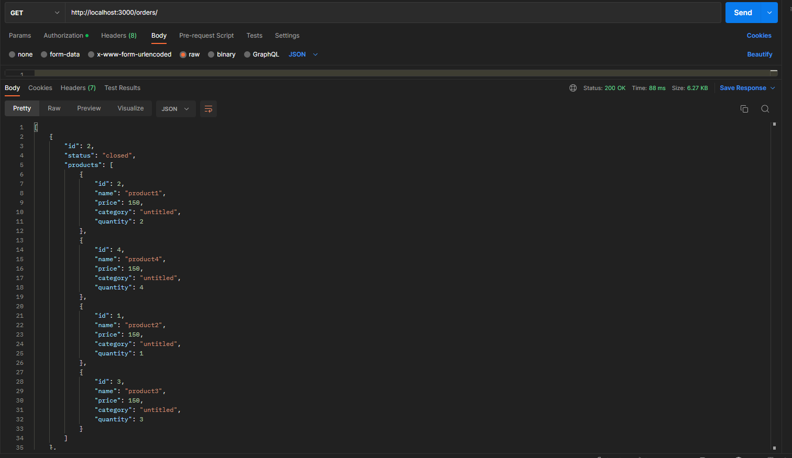

# StoreFront API

---

## Features

-   full authentication with Jwt
-   (users - product - orders) crud

---

## Endpoints

-   {app_url}/ => home page with welcome message

### Users

-   {app_url}/users/sign-up => sign up new user (post)
-   {app_url}/users/sign-in => sign in user (post)
-   {app_url}/users => listing all users (get)
-   {app_url}/users => create new users (post)
-   {app_url}/users/:id => delete user (delete)
-   {app_url}/users/:id => show user (get)
-   {app_url}/users/:id => update user (put)

#### Requirements

    - endpoints( sign up , create , update) require firstname ,lastname ,password
    - endpoint(sign in) only requires firstname and password
    - endpoint(update) password optional
    - all endpoint require jwt except sign up and sign in

---

### Products

-   {app_url}/products => listing all products (get)
-   {app_url}/products => create new products (post)
-   {app_url}/products/:id => delete product (delete)
-   {app_url}/products/:id => show product (get)
-   {app_url}/products/:id => update product (put)
-   {app_url}/products/top?limit={how many or 5} => update product (put)
-   {app_url}/products/:category/category => get products by category (get)

#### Requirements

    - endpoint(create, update) require category(optional by default untitled) ,price ,name
    - only endpoints (create, update) require jwt

---

### Orders

-   {app_url}/orders => listing all closed orders (get)
-   {app_url}/orders => create new orders (post)
-   {app_url}/orders/current => get current order (get)
-   {app_url}/orders/:id => update order (put)

#### Requirements

    - endpoint(create, update) require status in (closed , current) and products {product_id , quantity}
    - endpoint update  products is optional
    - all endpoint require jwt

---

## Error Handling

-   all point when data is invalid will return errors with status 422



---

## Usage

by

-   create username , password and database for testing and dev/production

    -   first login in postgres with root user

    ```shell
      psql -U postgres -W
      Password:
    ```

    -   create new user and database

    ```sql
        CREATE USER {your_user_name} WITH PASSWORD '{your_password}';
        CREATE DATABASE {your_database_name} WITH OWNER {your_user_name} ENCODING = 'utf8';
    ```

    -   same for testing user and db

    

-   copy .env.example to .env

    

-   and configure it with new users and dbs

    

-   run this command to initialize the app

    ```shell
      npm run init
    ```

-   visiting available endpoints and providing valid data

# Example

    `http://localhost:3000/orders`



## Available Scripts

-   to initialize the app

```shell
    npm init
```

-   to build the app

```shell
    npm run build
```

-   to start development server

```shell
    npm run start
```

-   to test the app

```shell
    npm run test
```

-   to fresh database

```shell
    npm run db:fresh
```

-   to migrate database

```shell
    npm run db:migrate
```

-   to format code (typescript)

```shell
    npm run format
```

-   to check code (typescript) errors

```shell
    npm run lint
```

---
